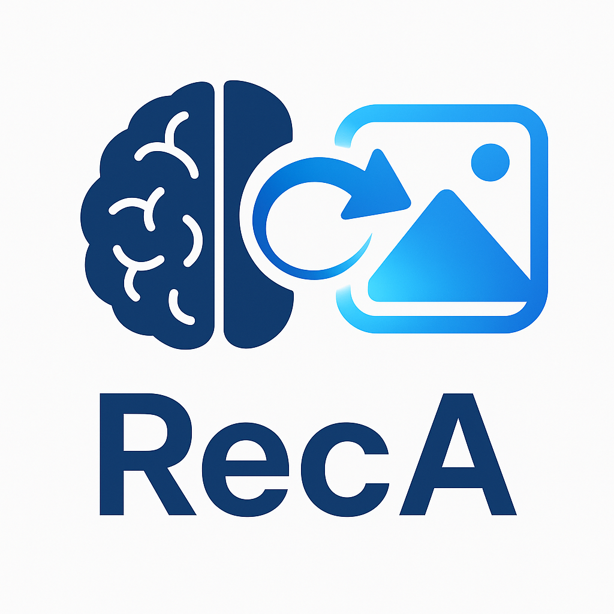
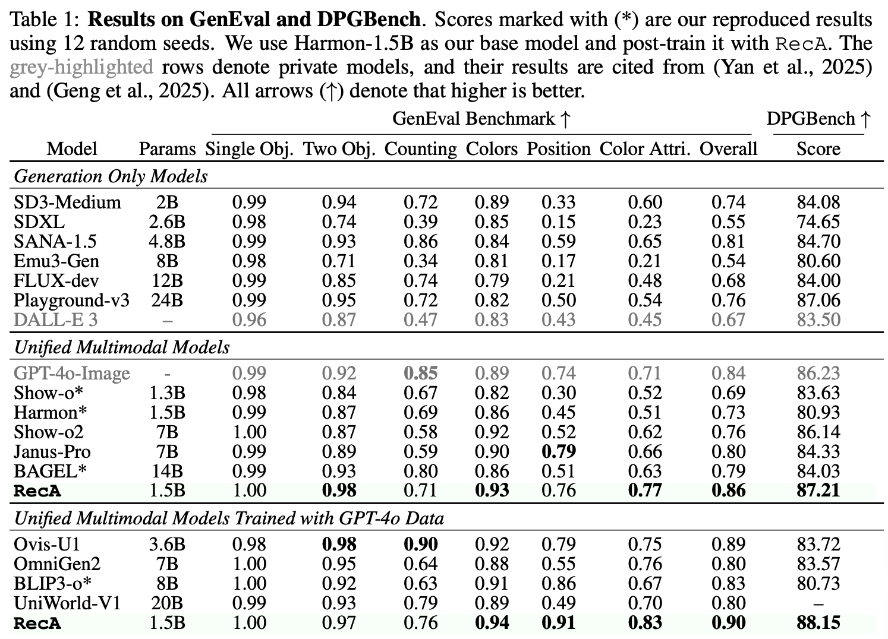
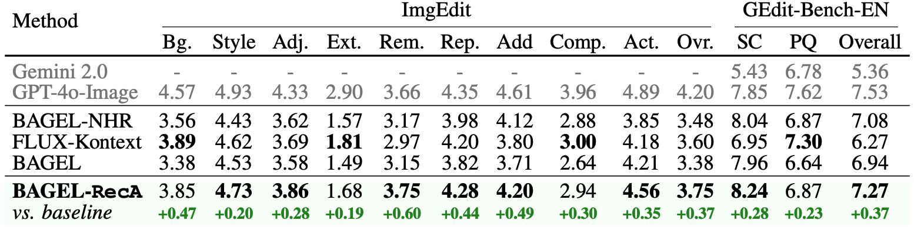
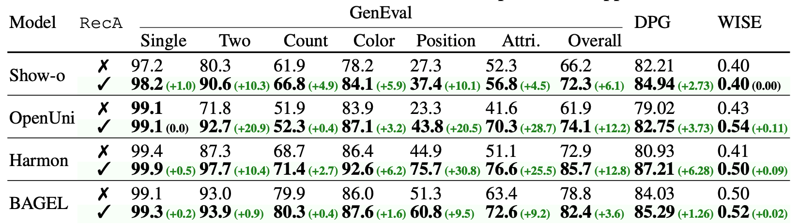

<div align="center">

  <h1 style="margin: 0; font-size: 1.8em;">
    
    RecA: Reconstruction Alignment Improves Unified Multimodal Models
  </h1>

  <h4 style="color: #7f8c8d; margin-top: 6px;">Unlocking the Massive Zero-shot Potential in Unified Multimodal Models through Self-supervised Learning</h3>

  [](https://arxiv.org/pdf/2509.07295)
  [](https://arxiv.org/abs/2509.07295)
  [](https://huggingface.co/collections/sanaka87/realign-68ad2176380355a3dcedc068)
  [-fcd022?style=for-the-badge&logo=huggingface&logoColor=000)](https://huggingface.co/spaces/sanaka87/BAGEL-ReAlign)
  [](https://reconstruction-alignment.github.io/)

</div>

<div align="center">
  
</div>

## 🔥 News

- **2025.9.9**: Our finetuned weights and arXiv paper are available! We expect to release the training code tomorrow.

## 🍭 Results

**RecA** achieves state-of-the-art performance on generation benchmarks with remarkable efficiency. Despite using only 1.5B parameters, RecA surpasses models with 7B-24B parameters, achieving GenEval **0.86** and DPGBench **87.21** without GPT-4o distillation data or reinforcement learning. RecA also improves BAGEL's editing performance significantly across all categories. Further two-stage fine-tuning with GPT-4o-Image distillation data enhances the score to **0.90** and **88.15** respectively.

<div align="center">
  
</div>

<div align="center">
  
</div>

We've tested RecA on various base architectures, including Show-o, OpenUni, Harmon, and BAGEL, consistently observing significant performance improvements across all models and benchmarks.


<div align="center">
  
</div>


## 🏆 Model Zoo

A collection of RecA models on Hugging Face with benchmark performance:

| Model Name | Parameters | GenEval | DPGBench | ImgEdit | GEdit |
|------------|------------|---------|----------|---------|-------|
| [BAGEL-RecA](https://huggingface.co/sanaka87/BAGEL-RecA) | 14B | 82.4 (+3.6) | 85.29 (+1.26) | 3.75 (+0.37) | 7.27 (+0.33) |
| [Harmon-0.5B-RecA](https://huggingface.co/sanaka87/Harmon-0.5B-RecA) | 0.5B | 78.7 (+11.1) | 84.67 (+4.55) | - | - |
| [Harmon-1.5B-RecA](https://huggingface.co/sanaka87/Harmon-1.5B-RecA) | 1.5B | 85.7 (+12.8) | 87.21 (+6.28) | - | - |
| [Show-o-RecA](https://huggingface.co/sanaka87/Show-o-RecA) | 1.3B | 61.9 (+5.3) | 75.70 (+5.05) | - | - |
| [Show-o-512x512-RecA](https://huggingface.co/sanaka87/Show-o-512x512-RecA) | 1.3B | 72.3 (+6.1) | 84.94 (+2.73) | - | - |
| [Harmon-1.5B-RecA-plus](https://huggingface.co/sanaka87/Harmon-1.5B-RecA-plus) | 1.5B | 90.0 | 88.15 | - | - |
| [OpenUni-RecA](https://huggingface.co/sanaka87/OpenUni-RecA) | 3.6B | 74.1 (+12.2) | 82.75 (+3.73) | - | - |

<!-- ## ✨ Getting Started -->

<!-- For detailed instructions on installation, training, and evaluation, please refer to the respective repository READMEs: -->

<!-- - **[BAGEL Training Guide](./BAGEL/README.md)**: Complete guide for BAGEL model training and evaluation -->
<!-- - **[Harmon Training Guide](./Harmon/README.md)**: Comprehensive instructions for Harmon model training and evaluation   -->
<!-- - **[Benchmark Evaluation Guide](./Benchmark/README.md)**: Multi-benchmark evaluation scripts and setup instructions -->

## 🚧 TODO

- [x] Release our model weights on Hugging Face.
- [ ] Release BAGEL and Harmon training code.
- [ ] Release Show-o and OpenUni training code.
- [ ] Further scale-up BAGEL training.
- [ ] Add support for new UMM architectures like Show-o2.

## 📮 Contact

For questions, feedback, or collaboration opportunities, feel free to reach out!

## 📄 Citation

If you find RecA useful for your research, please consider citing:

```bibtex
@misc{xie2025reconstructionalignmentimprovesunified,
      title={Reconstruction Alignment Improves Unified Multimodal Models}, 
      author={Ji Xie and Trevor Darrell and Luke Zettlemoyer and XuDong Wang},
      year={2025},
      eprint={2509.07295},
      archivePrefix={arXiv},
      primaryClass={cs.CV},
      url={https://arxiv.org/abs/2509.07295}, 
}
```

---

<div align="center">
  
  ⭐ **If you find this project helpful, please consider giving it a star!** ⭐
  
  [](https://www.star-history.com/#HorizonWind2004/reconstruction-alignment&Date)

</div>
