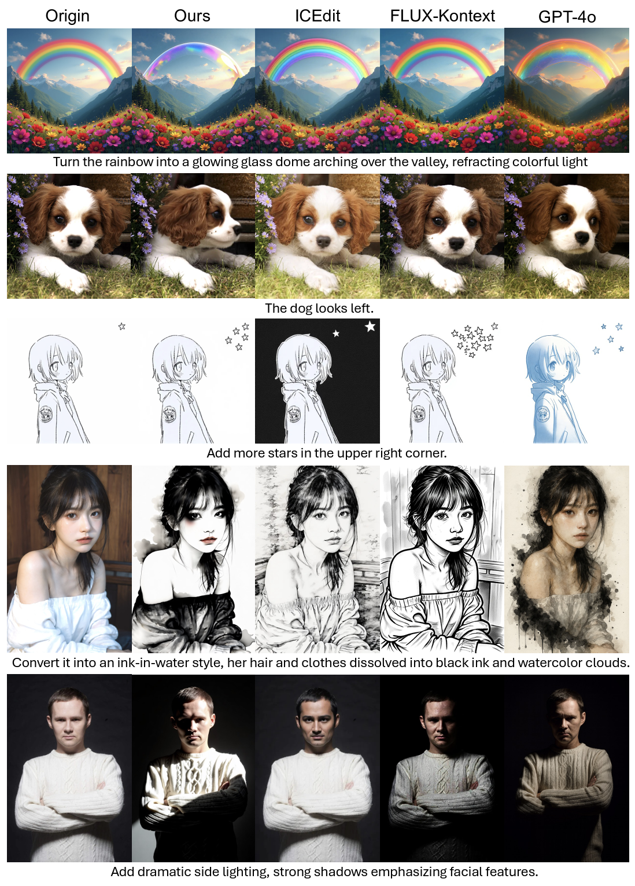

<div align="center">

  <h1 style="margin: 0; font-size: 1.8em;">
    
    RecA: Reconstruction Alignment Improves Unified Multimodal Models
  </h1>

  <h4 style="margin: 15px 0; color: #2c3e50;">
    🚀 Just 6 × 80GB A100s × 4.5 hours to boost BAGEL performance across all tasks! Our BAGEL outperforms FLUX-Kontext in image editing capabilities! Try to use BAGEL-RecA in [ComfyUI](#-quick-start)!
  </h4>

  [](https://arxiv.org/pdf/2509.07295)
  [](https://alphaxiv.org/abs/2509.07295)
  [](https://huggingface.co/collections/sanaka87/realign-68ad2176380355a3dcedc068)
  [-fcd022?style=for-the-badge&logo=huggingface&logoColor=000)](https://huggingface.co/spaces/sanaka87/BAGEL-RecA)
  [](https://reconstruction-alignment.github.io/)

</div>

<div align="center">
  <b>
    <a href="https://horizonwind2004.github.io/" target="_blank">Ji Xie</a><sup>1</sup>,
    <a href="https://people.eecs.berkeley.edu/~trevor/" target="_blank">Trevor Darrell</a><sup>1</sup>,
    <a href="https://homes.cs.washington.edu/~lsz/" target="_blank">Luke Zettlemoyer</a><sup>2</sup>,
    <a href="https://people.eecs.berkeley.edu/~xdwang/" target="_blank">XuDong Wang</a><sup>1*</sup>
  </b><br>
  <span style="font-size: 1em; color: #555;">UC Berkeley<sup>1</sup>; University of Washington<sup>2</sup></span>
</div>

## 📑 Table of Contents

- [🔥 News](#-news)
- [🔧 Quick Start](#-quick-start)
- [🏆 Model Zoo](#-model-zoo)
- [🍭 Results](#-results)
- [🎨 Edit Comparison](#-edit-comparison)
- [🚧 TODO](#-todo)
- [📮 Contact](#-contact)
- [📄 Citation](#-citation)

<div align="center">
  
  
</div>

## 🔥 News

- **2025.9.14**: 🔥 Add ComfyUI guide!
- **2025.9.11**: Harmon training code is released!
- **2025.9.10**: BAGEL training code is released! Harmon training code will be released soon.
- **2025.9.9**: Our [finetuned weights](https://huggingface.co/collections/sanaka87/realign-68ad2176380355a3dcedc068) and [arXiv paper](https://alphaxiv.org/abs/2509.07295) are available! We expect to release the training code tomorrow.

## 🔧 Quick Start!

1. Online Demo: Try out our enhanced [BAGEL-RecA demo](https://huggingface.co/spaces/sanaka87/BAGEL-RecA) on Hugging Face Spaces!


2. ComfyUI: see [ComfyUI-BAGEL](https://github.com/neverbiasu/ComfyUI-BAGEL). The usage is totally the same as the original ComfyUI-BAGEL but you should replace the BAGEL weight `models/bagel/BAGEL-7B-MoT/ema.safetensors` with RecA-tuned one.

```shell
wget https://huggingface.co/sanaka87/BAGEL-RecA/blob/main/model_bf16.safetensors
mv model_bf16.safetensors models/bagel/BAGEL-7B-MoT/ema.safetensors
```

The [ComfyUI-BAGEL](https://github.com/neverbiasu/ComfyUI-BAGEL) repo is already support the NF4 and INT8 version of BAGEL.

3. Local Setup: Follow the instructions in the [BAGEL Installation Guide](./BAGEL/README.md) to set up the environment, and run `BAGEL/inference.ipynb` to test the model locally!

4. Full Training & Evaluation: For detailed instructions on installation, training, and evaluation, please refer to the respective repository READMEs:

- **[BAGEL Installation Guide](./BAGEL/README.md)**: Complete guide for BAGEL model training and evaluation.

- **[Harmon Installation Guide](./Harmon/README.md)**: Comprehensive instructions for Harmon model training and evaluation.

- **[Benchmark Evaluation Guide](./Benchmark/README.md)**: Multi-benchmark evaluation scripts and setup instructions.

## 🏆 Model Zoo

A collection of RecA models on Hugging Face with benchmark performance:

| Model Name | Parameters | GenEval | DPGBench | ImgEdit | GEdit |
|------------|------------|---------|----------|---------|-------|
| [BAGEL-RecA](https://huggingface.co/sanaka87/BAGEL-RecA) | 14B | 82.4 (+3.6) | 85.29 (+1.26) | 3.75 (+0.37) | 7.27 (+0.33) |
| [Harmon-0.5B-RecA](https://huggingface.co/sanaka87/Harmon-0.5B-RecA) | 0.5B | 78.7 (+11.1) | 84.67 (+4.55) | - | - |
| [Harmon-1.5B-RecA](https://huggingface.co/sanaka87/Harmon-1.5B-RecA) | 1.5B | 85.7 (+12.8) | 87.21 (+6.28) | - | - |
| [Show-o-RecA](https://huggingface.co/sanaka87/Show-o-RecA) | 1.3B | 61.9 (+5.3) | 75.70 (+5.05) | - | - |
| [Show-o-512x512-RecA](https://huggingface.co/sanaka87/Show-o-512x512-RecA) | 1.3B | 72.3 (+6.1) | 84.94 (+2.73) | - | - |
| [Harmon-1.5B-RecA-plus](https://huggingface.co/sanaka87/Harmon-1.5B-RecA-plus) | 1.5B | 90.0 | 88.15 | - | - |
| [OpenUni-RecA](https://huggingface.co/sanaka87/OpenUni-RecA) | 3.6B | 74.1 (+12.2) | 82.75 (+3.73) | - | - |


## 🍭 Results

> Unlocking the Massive Zero-shot Potential in Unified Multimodal Models through Self-supervised Learning.

**RecA** achieves state-of-the-art performance on generation benchmarks with remarkable efficiency. Despite using only 1.5B parameters, RecA surpasses models with 7B-24B parameters, achieving GenEval **0.86** and DPGBench **87.21** without GPT-4o distillation data or reinforcement learning. RecA also improves BAGEL's editing performance significantly across all categories. Further two-stage fine-tuning with GPT-4o-Image distillation data enhances the score to **0.90** and **88.15** respectively.

<div align="center">
  
</div>

<div align="center">
  
</div>

We've tested RecA on various base architectures, including Show-o, OpenUni, Harmon, and BAGEL, consistently observing significant performance improvements across all models and benchmarks.


<div align="center">
  
</div>

## 🎨 Edit Comparison

Our method demonstrates superior image editing capabilities compared to state-of-the-art models including ICEdit, FLUX-Kontext, and GPT-4o:

<div align="center">
  
</div>

## 🚧 TODO

- [x] Release our model weights on Hugging Face.
- [x] Release BAGEL training code.
- [x] Release Harmon training code.
- [x] Add ComfyUI guide.
- [ ] Release Show-o and OpenUni training code.
- [ ] Further scale-up BAGEL training.
- [ ] Add support for new UMM architectures like Show-o2.

## 📮 Contact

For questions, feedback, or collaboration opportunities, feel free to reach out!

📧 Email: sanaka@berkeley.edu

## 📄 Citation

If you find RecA useful for your research, please consider citing:

```bibtex
@article{xie2025reconstruction,
  title={Reconstruction Alignment Improves Unified Multimodal Models},
  author={Xie, Ji and Darrell, Trevor and Zettlemoyer, Luke and Wang, XuDong},
  journal={arXiv preprint arXiv:2509.07295},
  year={2025}
}
```

---

<div align="center">
  
  ⭐ **If you find this project helpful, please consider giving it a star!** ⭐
  
  [](https://www.star-history.com/#HorizonWind2004/reconstruction-alignment&Date)

</div>
